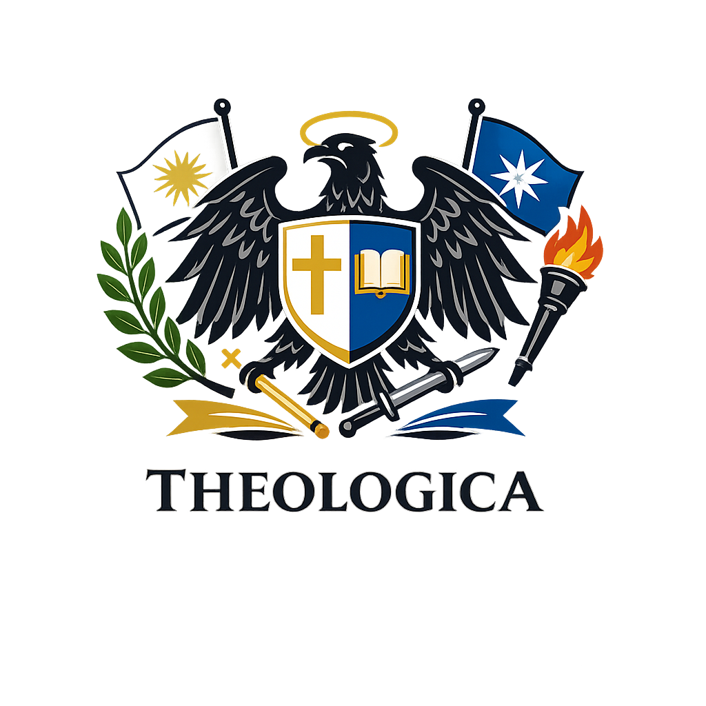

# 🏛️ Auswärtiges Amt - Freie Republik Theologica

<div align="center">



**Reise- und Sicherheitshinweise für Gotham City**

[](https://astro.build/)
[](https://www.typescriptlang.org/)
[](https://developer.mozilla.org/en-US/docs/Web/CSS)

_Schulprojekt Religionsunterricht • Februar 2026_

[🚀 Live Demo](#) • [📖 Dokumentation](#projektbeschreibung) • [💻 Installation](#-installation--entwicklung)

</div>

---

### 🎓 Projektbeschreibung

> 🎯 **Mission**: Eine authentische Nachstellung des deutschen Auswärtigen Amts zur ethischen Reflexion über staatliche Verantwortung, Bürgerschutz und gesellschaftliche Herausforderungen.

Dies ist ein **fiktives Schulprojekt** für den Religionsunterricht, das eine professionelle Website im Stil des deutschen Auswärtigen Amts nachstellt. Das Projekt demonstriert die Auseinandersetzung mit ethischen Fragen anhand der fiktiven Stadt "Gotham City".

### ✨ Features

- 🎨 **Authentic Design**: Pixel-genaue Nachstellung des AA-Designs
- 📱 **Responsive Layout**: Optimiert für alle Bildschirmgrößen
- ⚡ **Modern Tech Stack**: Astro + TypeScript + Vanilla CSS
- 🔒 **Security Warnings**: Realistische Reisewarnungen und Sicherheitshinweise
- 🌐 **Multi-Section Layout**: Strukturierte Informationsdarstellung
- 📊 **Government Branding**: Vollständiges Corporate Design der FRT
- 🚀 **Performance**: Optimiert für schnelle Ladezeiten

### 🌟 Lernziele

- 🧠 **Ethische Reflexion**: Diskussion über staatliche Verantwortung und Bürgerschutz
- 🏛️ **Gesellschaftliche Analyse**: Untersuchung von Sicherheit, Korruption und gesellschaftlichen Strukturen
- 💻 **Technische Kompetenz**: Erstellung einer professionellen Website mit modernen Web-Technologien
- 📺 **Kritische Medienanalyse**: Verstehen offizieller Kommunikationsformen und deren Wirkung

## 📸 Screenshots

<div align="center">

### Desktop Version


_Hauptseite mit vollständiger Headerleiste und Navigation_

### Mobile Version


_Responsive Design für Mobilgeräte_

### Sicherheitshinweise


_Detaillierte Reisewarnungen und Sicherheitsinformationen_

</div>

### 🏛️ Fiktiver Staat: Freie Republik Theologica

**Staatsname**: Freie Republik Theologica (FRT)  
**Regierungsform**: Föderale Republik mit religiös-ethischen Grundwerten  
**Hauptstadt**: Sancta Civitas  
**Amtssprache**: Deutsch  
**Staatsmotto**: "Weisheit. Gerechtigkeit. Nächstenliebe."

#### Staatssymbolik

- **Farben**: Blau (Weisheit), Gold (Göttlichkeit), Weiß (Reinheit)
- **Wappen**: Goldener Kreis mit blauem Kreuz und Buch (Wissen/Glaube)
- **Initialen**: FRT (Freie Republik Theologica)

### 🎯 Projektkontext

Dieses Projekt entstand im Rahmen einer Unterrichtsreihe über:

- **Staatliche Verantwortung** und Bürgerschutz
- **Ethische Dilemmata** in der öffentlichen Sicherheit
- **Mediale Darstellung** von Krisengebieten
- **Religion und Staat**: Werte in der Politik

### 🛠️ Technische Umsetzung

<div align="center">


</div>

#### 🔧 Tech Stack

| Technologie    | Version | Zweck                             |
| -------------- | ------- | --------------------------------- |
| **Astro**      | 4.0+    | Static Site Generator & Framework |
| **TypeScript** | 5.0+    | Type-sichere Entwicklung          |
| **CSS3**       | -       | Responsive Design & Animations    |
| **HTML5**      | -       | Semantische Struktur              |

#### ⚡ Performance Features

- 🚀 **Static Generation**: Pre-rendered HTML für maximale Performance
- 📦 **Component Islands**: Minimaler JavaScript-Bundle
- 🎨 **CSS Optimization**: Vanilla CSS ohne Framework-Overhead
- 📱 **Mobile First**: Responsive Design von Grund auf
- 🔍 **SEO Optimized**: Meta-Tags und strukturierte Daten

#### 📁 Projektstruktur

```
religion-reisewarnung/
├── 📁 public/
│   ├── 🖼️ theologica_logo.png      # Staatswappen FRT
│   └── 📄 favicon.ico
├── 📁 src/
│   ├── 🧩 components/
│   │   ├── 🚨 AlertBox.astro         # Warnsystem-Komponenten
│   │   ├── 📄 ContentSection.astro   # Inhalts-Sektionen
│   │   ├── 🔧 PageHeader.astro       # Page Header Component
│   │   └── 📁 sections/              # Spezifische Sektionen
│   │       ├── 🏛️ PoliticalSituation.astro
│   │       ├── 🔒 SecurityWarning.astro
│   │       ├── ⚖️ LegalSection.astro
│   │       └── 💊 HealthSection.astro
│   ├── 🎨 layouts/
│   │   ├── 📐 BaseLayout.astro       # Haupt-Layout im AA-Stil
│   │   ├── 📱 MinimalLayout.astro    # Minimales Layout
│   │   └── 🆕 NewBaseLayout.astro    # Erweiterte Layout-Version
│   ├── 📄 pages/
│   │   └── 🏠 index.astro            # Hauptseite mit allen Sektionen
│   └── 🎨 styles/
│       ├── 🎯 base.css               # Basis-Styles
│       └── 📐 layout.css             # Layout-spezifische Styles
├── ⚙️ astro.config.mjs               # Astro-Konfiguration
├── 📦 package.json                   # Dependencies & Scripts
├── 🔧 tsconfig.json                  # TypeScript-Konfiguration
└── 📖 README.md                      # Diese Datei
```

#### Komponenten-Architektur

**BaseLayout.astro**

- Hauptlayout im Stil des deutschen Auswärtigen Amts
- Responsive Design
- Staatliches Branding der FRT
- Disclaimer für Bildungszwecke

**AlertBox.astro**

- Wiederverwendbare Warnung-Komponenten
- Verschiedene Typen: warning, danger, info, security
- Konsistente Darstellung kritischer Informationen

**ContentSection.astro**

- Strukturierte Inhalts-Sektionen
- Icon-Integration
- Verschiedene Varianten: warning, info, neutral
- Responsive Gestaltung

### 🚀 Installation & Entwicklung

#### 📋 Voraussetzungen

- **Node.js** >= 18.0.0
- **npm** >= 9.0.0 oder **yarn** >= 1.22.0
- **Git** für Versionskontrolle

#### ⚡ Quick Start

```bash
# 1. Repository klonen
git clone https://github.com/justthatrandomcoder/religion-reisewarnung.git
cd religion-reisewarnung

# 2. Dependencies installieren
npm install

# 3. Entwicklungsserver starten
npm run dev
```

🌐 **Die Website ist dann erreichbar unter**: [`http://localhost:4321`](http://localhost:4321)

#### 🛠️ Verfügbare Scripts

| Script         | Befehl               | Beschreibung                                  |
| -------------- | -------------------- | --------------------------------------------- |
| **Dev Server** | `npm run dev`        | Startet den Development Server mit Hot Reload |
| **Build**      | `npm run build`      | Erstellt optimierten Production Build         |
| **Preview**    | `npm run preview`    | Preview des Production Builds lokal           |
| **Lint**       | `npm run lint`       | Code Quality Check                            |
| **Type Check** | `npm run type-check` | TypeScript Typprüfung                         |

#### 📁 Projektstruktur

## 🎭 Disclaimer & Bildungshinweis

<div align="center">

> ⚠️ **WICHTIGER HINWEIS**
>
> Diese Website ist ein **fiktives Schulprojekt** für den Religionsunterricht.

</div>

### 🚫 Fiktive Inhalte

- 🏛️ Die **"Freie Republik Theologica"** ist ein erfundener Staat
- 🦇 Alle **Reisehinweise beziehen sich auf die fiktive "Gotham City"**
- 🃏 **Batman, Joker, Wayne Enterprises** etc. sind Urheberrechte von DC Comics
- 📚 Alle Informationen dienen **ausschließlich Bildungszwecken**
- 🚫 Keine reale Reiseempfehlung oder offizielle Kommunikation

### 🎓 Bildungskontext

- 📖 **Fach**: Religionsunterricht
- 🏫 **Thema**: Ethik, Staatsverantwortung & gesellschaftliche Werte
- 🎯 **Ziel**: Reflexion über Sicherheit, Moral und staatliches Handeln
- 💡 **Methode**: Praktische Umsetzung durch Web-Development

### 🤝 Credits & Inspiration

- **Design-Inspiration**: Deutsches Auswärtiges Amt (aa.de)
- **Fiktiver Kontext**: DC Comics Gotham City Universum
- **Technologie**: Astro Framework Community
- **Bildungskontext**: Religionsunterricht Deutschland

### 📧 Projektinformation

- **Erstellt**: Februar 2026
- **Kontext**: Schulprojekt Religionsunterricht
- **Zweck**: Bildung, Reflexion gesellschaftlicher Werte
- **Framework**: Astro.js mit modernen Web-Standards

---

<div align="center">

## 📧 Kontakt & Credits

**👨‍💻 Entwickelt von**: Julius Grimm  
**📅 Erstellt**: Februar 2026  
**🎓 Kontext**: Schulprojekt Religionsunterricht

### 💡 Inspiration & Credits

| Element          | Quelle                                             |
| ---------------- | -------------------------------------------------- |
| 🎨 **Design**    | Deutsches Auswärtiges Amt ([aa.de](https://aa.de)) |
| 🦇 **Kontext**   | DC Comics Gotham City Universum                    |
| ⚡ **Framework** | [Astro.js Community](https://astro.build)          |
| 🎓 **Bildung**   | Religionsunterricht Deutschland                    |

### 🌟 Danksagungen

- 🙏 **Lehrkraft** für die kreative Projektidee
- 💻 **Open Source Community** für die verwendeten Tools
- 🎨 **Webdesign-Community** für Inspiration und Best Practices

---


**🏛️ Auswärtiges Amt der Freien Republik Theologica**  
_Bildungsprojekt | Religionsunterricht 2026_  
_Alle Angaben sind fiktiv und dienen ausschließlich Lernzwecken_

📍 **Status**: Aktives Lernprojekt  
🔄 **Updates**: Nach Bedarf  
📖 **Lizenz**: Nur für Bildungszwecke

</div>
